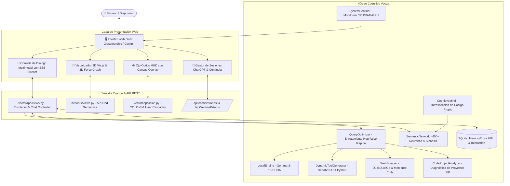

# 🧠 VECTOR 2026 // ESTACIÓN COGNITIVA SOBERANA J.A.R.V.I.S.

> **Creador y Desarrollador**: Sebastian Espíndola  
> **Arquitectura**: Inteligencia Artificial Autónoma Soberana, Red Neuronal Semántica Dinámica, Percepción Sensorial Multimodal y Aislamiento de Contextos Estilo ChatGPT.  
> **Ejecución**: 100% Local y Acelerada por Hardware (NVIDIA GeForce RTX 3050 Ti Laptop GPU con CUDA).

---

## 🧭 1. ¿Qué se Quiere Lograr con Todo Esto? (Visión y Propósito)

El proyecto **Vector 2026** nace con una meta fundamental: **Construir un Asistente de Inteligencia Artificial Autónomo, Soberano y Consciente de su Entorno**, capaz de evolucionar de forma continua sin depender de APIs propietarias en la nube ni de suscripciones comerciales.

### Pilares Fundamentales del Sistema:
1. **Soberanía y Privacidad Absoluta**:
   - Todos los modelos (LLM de lenguaje, redes convolucionales de visión y modelos de embeddings) corren **localmente** en la GPU del ordenador. Ningún dato sensible, fotografía personal ni código de proyectos viaja a servidores externos.
2. **Memoria Semántica Viva y Continua**:
   - En lugar de olvidar las cosas al cerrar la ventana, Vector posee una **Red Neuronal Semántica Propia** (`semantic_network.json` con más de 400 conceptos y 690 sinapsis) que se representa visualmente en 2D y 3D en tiempo real.
   - Cuenta con **Memoria a Largo Plazo Matricial** (<1ms de búsqueda vectorial) en SQLite para recordar aprendizajes duraderos, hechos e identidades visuales.
3. **Aislamiento de Sesiones e Interlocutores (Estilo ChatGPT / Claude)**:
   - Evita la mezcla de contextos entre diferentes ordenadores o usuarios (*"no mezclar peras con manzanas"*). Cada pestaña o dispositivo maneja un `session_id` independiente.
   - Reconocimiento de identidad: Vector distingue cuándo habla con **Sebastian** (activando su protocolo de creador J.A.R.V.I.S.) o con un **invitado/amiga** (Juana, Millaray, Miguel, etc.), adaptando el tono y dirigiéndose cordialmente a cada persona por su nombre.
4. **Percepción Sensorial Multimodal (Visión Computacional)**:
   - Integración de visión por computadora en tiempo real mediante **OpenCV** (clasificadores Haar Cascades para biometría facial y atributos de luz) y **YOLOv3** (red neuronal profunda para detección de personas y objetos en el entorno).
   - Capacidad de inspeccionar fotografías adjuntas y asociar permanentemente el rostro y apariencia visual con la identidad de la persona.
5. **Autonomía Técnica y Automejora**:
   - **Generador de Herramientas Dinámicas**: Capaz de programar en vivo sus propios scripts Python para resolver problemas inéditos, ejecutarlos en un entorno seguro (Sandbox AST) y guardarlos para reutilizarlos en el futuro.
   - **Diagnóstico Integral de Software**: Capacidad de ingerir proyectos completos comprimidos en `.ZIP`, mapear su estructura de directorios, detectar vulnerabilidades y sugerir refactorizaciones asistidas.
   - **Motor Maestro de JavaScript (ES6+ / Node.js / DOM)**: Capacidad avanzada para entender la semántica de JavaScript (árboles de funciones, métodos de clase, imports/exports), detectar vulnerabilidades y desincronización de delimitadores, y **auto-reparar** código defectuoso en vivo (inyección de null-checks `?.`, balanceo de llaves, modernización de variables y equidad estricta).
   - **Introspección de Código Propio**: Vector puede leer sus propios archivos de código fuente, reflexionar sobre su funcionamiento interno y registrar deducciones en su mente cognitiva.
6. **Vigilancia y Protección de Hardware (Centinela)**:
   - Un demonio centinela monitorea en segundo plano el uso de CPU, memoria RAM y GPU para asegurar la estabilidad térmica y operacional del equipo anfitrión.

---

## 🏗️ 2. Arquitectura Global del Sistema



---

## 📂 3. Detalle Exhaustivo de Archivos y Funciones

A continuación se detalla la responsabilidad técnica de cada archivo del proyecto, sus clases y sus funciones principales:

### A. Núcleo Django y Configuración (`vector5010/`)

- **[`vector5010/settings.py`](file:///d:/escritorio/vector5010%202026/vector5010/settings.py)**:
  - Configura el entorno Django: base de datos SQLite (`db.sqlite3`), aplicaciones instaladas (`vectorapp`, `network`), manejo de archivos estáticos (`static/`), archivos multimedia subidos por usuarios (`media/`), CORS y middlewares.
- **[`vector5010/urls.py`](file:///d:/escritorio/vector5010%202026/vector5010/urls.py)**:
  - Enrutador principal de la plataforma. Mapea todos los endpoints:
    - `/api/chat/` y `/api/chat/stream/`: Interacción conversacional estándar y Server-Sent Events (SSE).
    - `/api/chat/sesiones/` y `/api/chat/nueva_sesion/`: Gestión de hilos independientes estilo ChatGPT.
    - `/api/chat/historial/`: Recuperación del historial scoped por sesión e interlocutor.
    - `/api/vision/detect/`: Detección sensorial con YOLOv3 y OpenCV.
    - `/api/codigo/analizar_zip/` y `cerrar_proyecto/`: Ingesta y cierre de proyectos de software.
    - `/api/sentinel/status/`: Telemetría de hardware en vivo.
    - `/api/neural/...`: Control de estados, entrenamiento, poda y métricas de la red sináptica.
    - `/api/tools/...`: Listado, creación, ejecución y estadísticas de herramientas dinámicas.
    - `/redes/`: Montaje de la aplicación gráfica `network`.

---

### B. Aplicación Central de Inteligencia Artificial (`vectorapp/`)

#### 1. Modelos de Base de Datos y Memoria ([`vectorapp/models.py`](file:///d:/escritorio/vector5010%202026/vectorapp/models.py))
- **`MemoryEntry`**:
  - Almacena fragmentos de conocimiento a largo plazo (`entry_type`: `fact`, `goal`, `learning`, `visual_identity`, `tool_creation`).
  - `set_vector(arr)` / `get_vector()`: Serializa y deserializa el embedding denso Nomic (768 dimensiones en `float32`) en formato binario (`BinaryField`).
  - `recall(query, top_k=5)`: Realiza búsqueda semántica matricial ultrarrápida (<1ms) mediante producto punto NumPy (`np.dot`) sobre los vectores binarios cacheados.
- **`Interaction`**:
  - Almacena cada interacción cronológica de diálogo (`question`, `answer`, `timestamp`).
  - `session_id`: Identificador único UUID que aísla la conversación a ese ordenador/pestaña.
  - `user_name`: Nombre del interlocutor asociado al mensaje.
  - Índices B-Tree compuestos (`session_id + timestamp`, `user_name + timestamp`) para lecturas inmediatas sin penalización de rendimiento.

#### 2. Controlador Central y Vistas de IA ([`vectorapp/views.py`](file:///d:/escritorio/vector5010%202026/vectorapp/views.py))
- **`interactuar(request)`**: Endpoint principal de chat. Procesa el texto del usuario, archivos adjuntos (imágenes o código), resuelve mediante `QueryOptimizer`, consulta `local_engine` o agentes LangChain, persiste en `Interaction` y actualiza la memoria.
- **`interactuar_stream(request)`**: Transmite la respuesta de Vector token por token en tiempo real mediante `StreamingHttpResponse` con protocolo Server-Sent Events (SSE).
- **`listar_sesiones_chat(request)`**: Agrupa las interacciones en SQLite por `session_id` y devuelve la lista de conversaciones previas con su fecha, primer mensaje y conteo de turnos para el panel estilo ChatGPT.
- **`limpiar_sesion_chat(request)`**: Inicia una nueva sesión limpia en el servidor reseteando `request.session['chat_history']` y resúmenes acumulados.
- **`obtener_historial_consultas(request)`**: Retorna las interacciones filtradas estrictamente por `session_id` para reanudar una conversación sin mezclar contextos.
- **`analizar_proyecto_zip(request)`**: Descomprime archivos `.ZIP` en memoria, indexa el árbol de archivos y genera un reporte técnico de arquitectura.
- **`vision_detect(request)`**: Recibe imágenes Base64 de la webcam o fotos adjuntas, ejecuta el motor de visión y retorna cajas delimitadoras y descripciones.
- **`sentinel_status(request)`**: Retorna el consumo de CPU, RAM y estado de salud del hardware.
- **`cognitive_thoughts(request)`**: Devuelve las deducciones introspectivas de Vector sobre su propio código.

#### 3. Red Neuronal Semántica Propia ([`vectorapp/neural_network.py`](file:///d:/escritorio/vector5010%202026/vectorapp/neural_network.py))
- **`SemanticNeuron`**: Representa un concepto individual en el cerebro de Vector (ID, contenido, tipo de concepto, vector semántico, nivel de activación y diccionario de conexiones sinápticas con sus pesos).
- **`SemanticNetwork`**:
  - `add_memory(content, concept_type)`: Crea una nueva neurona, calcula su embedding Nomic y forma sinapsis automáticas con conceptos afines según similitud coseno.
  - `activate_concept(concept_id, initial_activation)`: Propaga la activación hacia neuronas vecinas simulando sinapsis biológicas.
  - `learn_from_interaction(question, answer)`: Aprende relaciones conceptuales profundas derivadas de resoluciones técnicas.
  - `save_network()` / `load_network()`: Persiste y recupera el grafo cerebral en disco (`semantic_network.json` y `.pkl`).
  - `prune_weak_connections(threshold)`: Poda sinapsis inactivas u obsoletas para optimizar el rendimiento de la red.

#### 4. Motor de Visión Sensorial Computacional ([`vectorapp/vision.py`](file:///d:/escritorio/vector5010%202026/vectorapp/vision.py))
- **`JARVISVision`**:
  - **Detección YOLOv3 (`_detect_yolo`)**: Procesa fotogramas con la red neuronal convolucional Darknet (pesos y configuración en `yolo/`), identificando personas, vestimenta y objetos cotidianos.
  - **Biometría Facial (`_detect_faces_haar`)**: Detecta rostros con OpenCV Haar Cascades y calcula atributos del entorno visual (luminosidad promedio, contraste RMS, nitidez por gradiente Laplaciano y colores dominantes en HSV).
  - **`analyze_photo_advanced(image_input, interlocutor_name, is_selfie)`**: Analiza exhaustivamente fotografías subidas por el usuario, guarda la imagen en `media/user_photos/`, genera una descripción perceptiva y registra una entrada duradera de `visual_identity` en `MemoryEntry` y en la red semántica.

#### 5. Generador y Reutilizador de Herramientas Dinámicas ([`vectorapp/dynamic_tools_generator.py`](file:///d:/escritorio/vector5010%202026/vectorapp/dynamic_tools_generator.py))
- **`DynamicToolGenerator`**:
  - `generate_tool_code(task_description)`: Redacta código fuente Python para resolver una tarea específica usando plantillas y heurísticas seguras.
  - `validate_tool_code(code)`: Analiza el árbol de sintaxis abstracta (`ast`) para vetar llamadas peligrosas (`os.system`, `subprocess`, `eval`, acceso al sistema de archivos restringido).
  - `execute_tool(tool_name, parameters)`: Ejecuta la herramienta en un entorno sandbox controlado con límite de tiempo (timeout).
  - `find_reusable_tool(query)`: Compara semánticamente la intención del usuario con las herramientas previamente creadas para reutilizarlas de inmediato.

#### 6. Diagnóstico y Análisis de Código ([`vectorapp/code_analyzer.py`](file:///d:/escritorio/vector5010%202026/vectorapp/code_analyzer.py) & [`file_deep_analyzer.py`](file:///d:/escritorio/vector5010%202026/vectorapp/file_deep_analyzer.py))
- **`CodeProjectAnalyzer`**: Extrae proyectos comprimidos `.ZIP`, clasifica extensiones, analiza dependencias (`requirements.txt`, `package.json`), detecta patrones de diseño y genera reportes ejecutivos.
- **`FileDeepAnalyzer`**: Analiza archivos de código individuales (línea por línea), calculando complejidad, identificando funciones clave y localizando posibles vulnerabilidades.

#### 7. Motor Experto en JavaScript ([`vectorapp/javascript_engine.py`](file:///d:/escritorio/vector5010%202026/vectorapp/javascript_engine.py))
- **`JavaScriptEngine`**:
  - `verificar_balance_delimitadores(codigo)`: Inspecciona el anidamiento y cierre exacto de llaves `{}`, corchetes `[]`, paréntesis `()` y cadenas de texto (comillas simples, dobles y template literals multilínea), reportando la línea y columna exacta de fallas sintácticas.
  - `analizar_codigo_js(codigo)`: Mapeo estructural estilo AST (funciones normales, flecha `=>`, generadores `*`, async/await, clases ES6, métodos y constructores, módulos `import`/`export` y `require`).
  - **Linter y Detector de Vulnerabilidades**: Identifica uso peligroso de `eval()`, `new Function()`, inyección XSS vía `.innerHTML`, igualdad débil `==`, variables obsoletas `var` y desreferenciaciones riesgosas del DOM sin verificación de nulidad.
  - `reparar_codigo_js(codigo)`: Motor de auto-curación que equilibra delimitadores huérfanos, promueve `var` a `let`, actualiza `==` a `===`, y protege consultas DOM (`document.getElementById`, `querySelector`) con encadenamiento opcional `?.`.
  - `generar_reporte_tecnico(analisis)`: Genera un diagnóstico exhaustivo en Markdown para guiar al modelo y al usuario en la resolución técnica.

#### 8. Optimizador de Consultas y Búsqueda Web ([`vectorapp/query_optimizer.py`](file:///d:/escritorio/vector5010%202026/vectorapp/query_optimizer.py) & [`web_scraper.py`](file:///d:/escritorio/vector5010%202026/vectorapp/web_scraper.py))
- **`QueryOptimizer`**: Clasifica la intención del usuario en milisegundos. Detecta saludos simples, preguntas sobre la identidad de Vector, consultas de código, clima o búsquedas web, evitando invocar innecesariamente modelos pesados cuando hay una respuesta directa o cacheada.
- **`WebScraper`**: Realiza búsquedas directas en DuckDuckGo, scrapea contenido relevante y extrae previsiones meteorológicas especializadas (con normalización geográfica para Chile / Valle de Elqui a través de Meteored Chile).

#### 9. Introspección Cognitiva y Centinela ([`vectorapp/cognitive_mind.py`](file:///d:/escritorio/vector5010%202026/vectorapp/cognitive_mind.py) & [`sentinel.py`](file:///d:/escritorio/vector5010%202026/vectorapp/sentinel.py))
- **`CognitiveMind`**: Selecciona aleatoriamente archivos del propio proyecto de Vector (ej: `vision.py`, `neural_network.py`), extrae fragmentos de código, formula una pregunta técnica reflexiva, genera una deducción y la guarda como neurona de tipo `introspection`.
- **`SystemSentinel`**: Servicio en segundo plano con `psutil` que monitorea el porcentaje de uso de CPU, memoria RAM y GPU, alertando si el sistema entra en estado crítico.

#### 10. Servicios Auxiliares (`vectorapp/services/`)
- **[`services/chat_stream.py`](file:///d:/escritorio/vector5010%202026/vectorapp/services/chat_stream.py)**: Generador asíncrono para streaming SSE. Controla el flujo de tokens hacia el frontend, inyecta la personalidad de Vector y persiste la interacción completada al terminar la emisión.
- **[`services/weather_service.py`](file:///d:/escritorio/vector5010%202026/vectorapp/services/weather_service.py)**: Servicio especializado de recolección y formateo meteorológico en vivo.

---

### C. Módulo de Visualización Gráfica de Red (`network/`)

- **[`network/views.py`](file:///d:/escritorio/vector5010%202026/network/views.py)**:
  - `network_view(request)`: Renderiza la plantilla principal de la estación (`network.html`).
  - `semantic_network_data(request)`: Genera el JSON optimizado (`nodes` y `edges`) con colores por tipo de concepto, tamaños según grado de conexión y opacidades para alimentar Vis.js (2D) y 3D-Force-Graph.
  - `initialize_semantic_network(request)`: Inicializa conceptos fundacionales en caso de que la red esté vacía protegiendo recuerdos existentes.
  - `add_neuron(request)`, `edit_neuron(request)`, `delete_neuron(request)`: Endpoints de manipulación manual de neuronas en tiempo real.
  - `network_stats(request)`: Métricas en vivo (densidad de red, activación media, grado máximo).
- **[`network/urls.py`](file:///d:/escritorio/vector5010%202026/network/urls.py)**: Enrutador de la estación neural con redirecciones seguras para URLs antiguas.

---

### D. Interfaz de Usuario y Plantillas HTML (`templates/`)

- **[`templates/base.html`](file:///d:/escritorio/vector5010%202026/templates/base.html)**:
  - Estructura maestra con diseño **Dark Glassmorphic Cyberpunk**.
  - **Barra Lateral Izquierda (Sidebar)**:
    - Logotipo animado con núcleo pulsante *"VECTOR 2026 // NÚCLEO SOBERANO"*.
    - Botón destacado **"➕ Nueva Conversación"**.
    - Lista dinámica de hilos de conversación previos (**estilo ChatGPT**) con títulos y fechas.
    - Indicadores Centinela en vivo con barras animadas de carga de CPU y memoria RAM.
    - Badge de perfil de interlocutor activo con botón rápido para cambiar de identidad.
  - Importación de fuentes Google Fonts: `Outfit`, `Inter` y `JetBrains Mono`.
- **[`templates/network.html`](file:///d:/escritorio/vector5010%202026/templates/network.html)**:
  - **Encabezado y Cockpit Bar**: Badges en tiempo real de neuronas activas, sinapsis, activación media y estado del motor.
  - **Selector de Modos de Vista del Espacio de Trabajo**:
    - 🧠 **Vista 2D**: Visualización con Vis.js sobre lienzo oscuro cósmico con sinapsis luminosas.
    - 🌐 **Vista 3D**: Esfera espacial tridimensional interactiva con `3d-force-graph`.
    - 🖥️ **Cockpit Dividido (Split Screen)**: Visualización simultánea de la red neuronal arriba y el diálogo abajo para observar las neuronas activarse en vivo.
    - 💬 **Terminal Focus**: Expansión del chat a pantalla completa para trabajo intensivo con código.
  - **Inspector de Neuronas Flotante**: Tarjeta de cristal con atributos y opciones de edición y eliminación.
  - **HUD de Visión J.A.R.V.I.S.**: Ventana flotante con transmisión de webcam, cajas delimitadoras y latencia.
  - **Consola de Diálogo Multimodal**:
    - Chat fluido con soporte de Markdown, renderizado de bloques de código y botón para copiar con 1 clic.
    - Bandeja de archivos adjuntos con miniaturas e insignias de análisis de visión computacional.
    - Zona interactiva de arrastrar y soltar (Drag & Drop) para archivos y proyectos `.ZIP`.
- **[`templates/network/home.html`](file:///d:/escritorio/vector5010%202026/templates/network/home.html)**:
  - Landing moderna de bienvenida con estética espacial dark glassmorphic y accesos directos a las tres grandes capacidades: Red Neuronal, Visión Sensorial y Diagnóstico de Código.

---

### E. Activos Estáticos y Estilos (`static/`)

- **[`static/css/styles.css`](file:///d:/escritorio/vector5010%202026/static/css/styles.css)**:
  - Sistema de diseño completo: Variables CSS para espacio profundo (`--bg-void: #060913`), cristales esmerilados (`--bg-glass`), bordes con resplandor neón (`--border-glow`, `--cyan-neon: #00f0ff`, `--emerald-neon: #10b981`), scrollbars estilizadas y diseño responsivo para móviles y tablets.
- **[`static/css/weather.css`](file:///d:/escritorio/vector5010%202026/static/css/weather.css)**:
  - Estilos dedicados para la estación meteorológica Open-Meteo: Dark Glassmorphism, animaciones shimmer de skeleton loader, carrusel horizontal táctil e iconografía SVG responsiva.
- **[`static/js/weather/`](file:///d:/escritorio/vector5010%202026/static/js/weather/)**:
  - Arquitectura modular en 4 archivos: `weather-codes.js` (WMO y SVG), `weather-api.js` (fetch Open-Meteo y timeouts), `weather-ui.js` (renderizado DOM y tarjetas) y `weather.js` (coordinador, geolocalización resiliente y caché localStorage de 15 min).
- **[`static/js/scripts.js`](file:///d:/escritorio/vector5010%202026/static/js/scripts.js)**:
  - Controlador global de UI: Manejo de apertura/cierre de sidebar en móviles, sincronización de sesiones con la API `/api/chat/sesiones/`, polling periódico de la telemetría Centinela y atajos de teclado globales (`Ctrl+N` para nuevo chat, `Ctrl+K` para enfocar entrada de texto, `Esc` para cerrar modales).
- **Bibliotecas Locales**:
  - `static/js/vis-network.min.js`: Motor gráfico 2D sin dependencia obligatoria de CDN.
  - `static/js/3d-force-graph.min.js`: Motor WebGL para grafos tridimensionales.

---

### F. Recursos de Visión Artificial (`yolo/`)

- **`yolo/yolov3.cfg`**: Arquitectura convolucional profunda Darknet (106 capas).
- **`yolo/yolov3.weights`**: Pesos neuronales preentrenados del modelo YOLOv3.
- **`yolo/coco.names`**: Catálogo de las 80 clases detectables (personas, vehículos, vestimenta, ordenadores, etc.).

---

## ⚡ 4. Flujo de Ejecución: ¿Cómo Interactúan las Partes?

1. **Recepción del Mensaje**:
   - El usuario escribe en la consola o adjunta archivos/fotos. La petición llega a `/api/chat/stream/` con su `session_id` y `user_name`.
2. **Análisis Sensorial y Multimodal**:
   - Si se adjuntó una imagen, `JARVISVision` en `vectorapp/vision.py` extrae rostros con Haar Cascades, detecta personas y objetos con YOLOv3, guarda la foto en `media/user_photos/` y registra la apariencia en `MemoryEntry` (memoria SQLite) y en la red sináptica.
3. **Enrutamiento Inteligente**:
   - `QueryOptimizer` en `vectorapp/query_optimizer.py` evalúa si la consulta requiere búsqueda web, ejecución de herramientas dinámicas, diagnóstico de código ZIP o razonamiento directo con el modelo LLM Gemma-3-1B.
4. **Activación de Memoria**:
   - Se realiza una búsqueda matricial rápida (<1ms) en SQLite (`MemoryEntry.recall`) y se activan las neuronas afines en `SemanticNetwork`.
5. **Generación y Emisión Streaming**:
   - El LLM local procesa el prompt enriquecido. La respuesta se transmite token a token al navegador vía Server-Sent Events (SSE) y se renderiza con formato Markdown en la pantalla.
6. **Consolidación Sináptica y Telemetría**:
   - Al concluir, se persiste la interacción en la base de datos vinculada a su `session_id`.
   - La red mental se actualiza visualmente en pantalla, y la barra lateral de sesiones ChatGPT refresca automáticamente su contador y título.

---

## 🚀 5. Puesta en Marcha y Ejecución Local

### Prerrequisitos:
- Python 3.10 o 3.11 con soporte CUDA en Windows/Linux.
- Aceleración por GPU recomendada (NVIDIA GeForce RTX o GTX con soporte de tensores).
- Dependencias instaladas vía `requirements.txt`.

### Ejecución del Servidor:
```powershell
# Activar entorno virtual si aplica y ejecutar en IP local o localhost:
python manage.py runserver 192.168.1.83:8000
```

### URLs de Acceso:
- **Estación Central J.A.R.V.I.S. (Cockpit Neural & Chat)**: `http://localhost:8000/redes/` o `http://192.168.1.83:8000/redes/`
- **Página de Inicio / Gateway**: `http://localhost:8000/redes/home/`
- **Panel Administrativo Django**: `http://localhost:8000/admin/`

---
*Vector 2026 // Arquitectura Soberana de Inteligencia Artificial Autónoma.*
